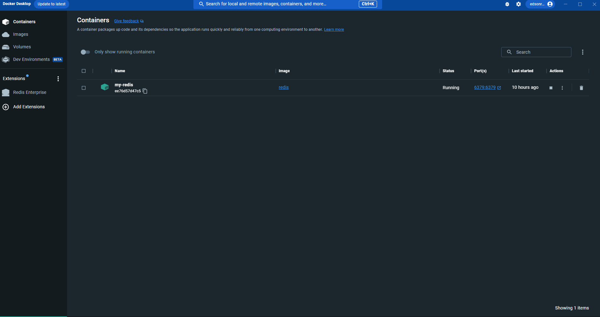
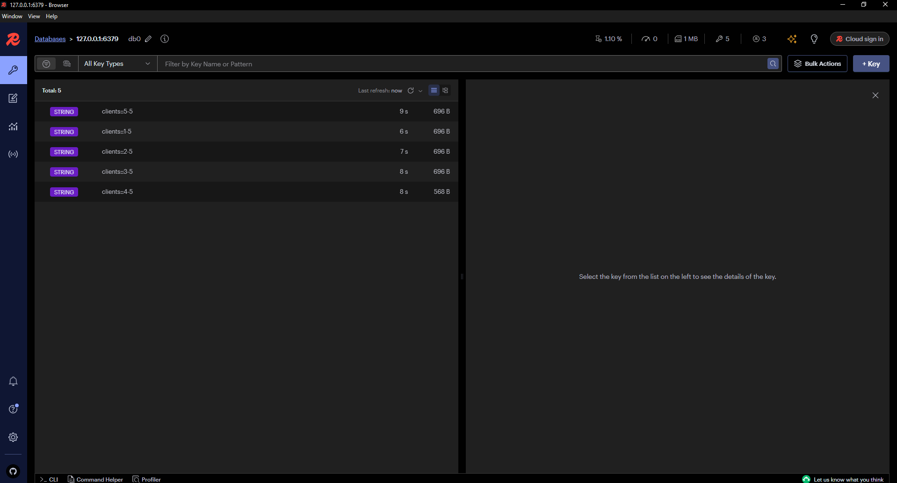
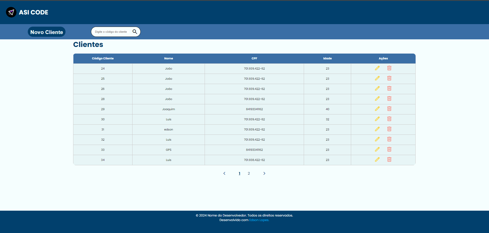
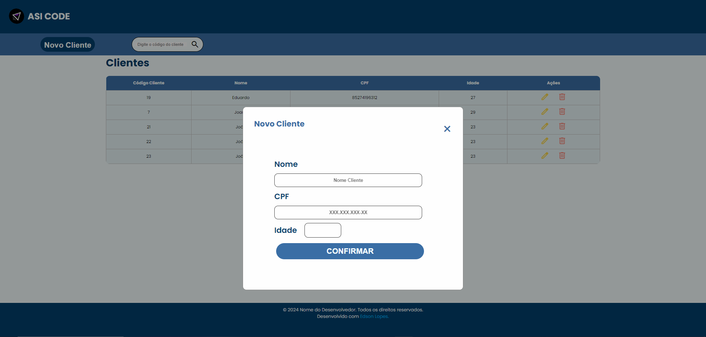
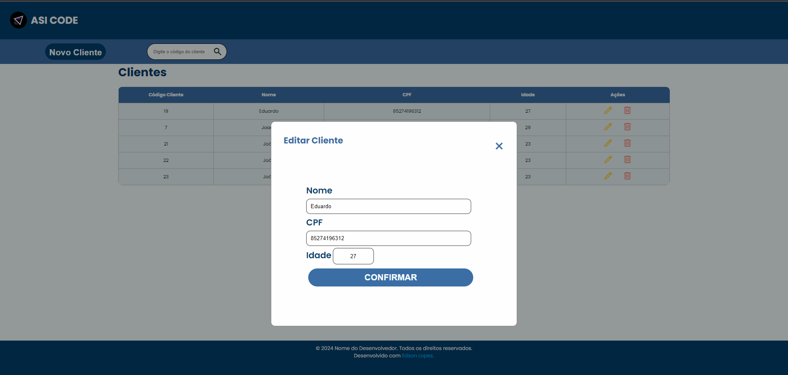
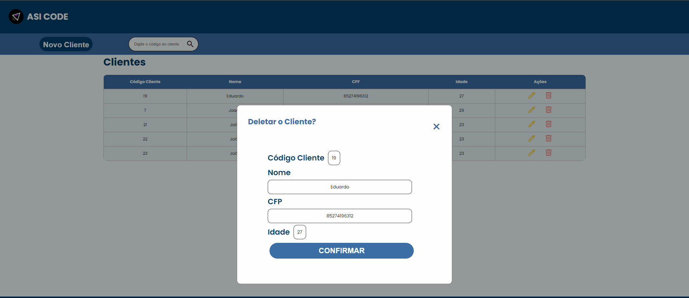
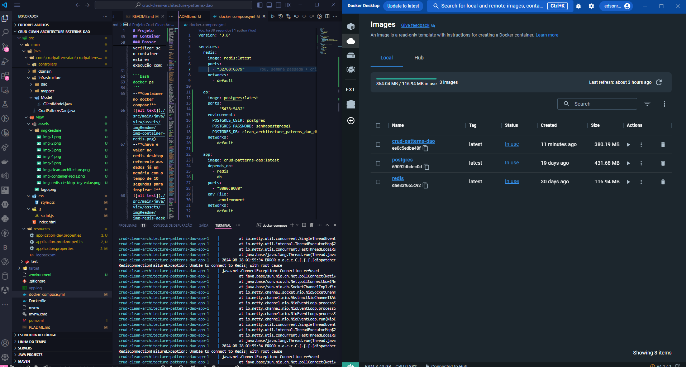
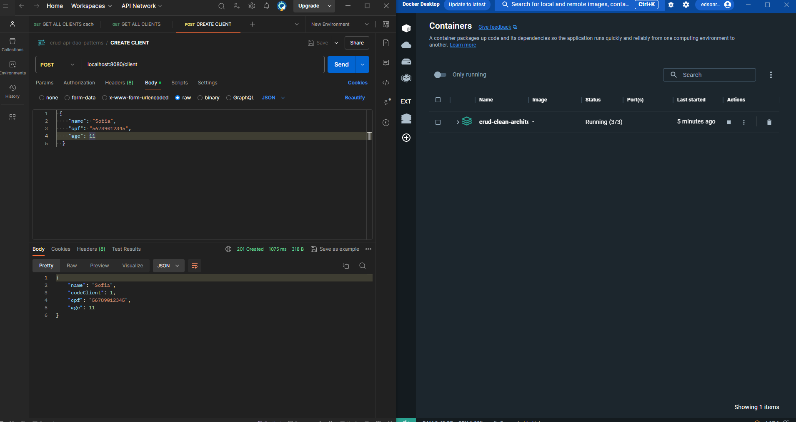

# Projeto Crud Clean Architecture  Patterns DAO 


## Visão Geral
Optei por usar essas tecnologias para desenvolver um CRUD simples, mas com a implementação de funcionalidades complexas para praticar. Este sistema visa demonstrar as práticas da Clean Architecture, aplicando os princípios do DDD (Domain-Driven Design) e mantendo a inversão de dependência. O projeto consiste em um CRUD de cliente com paginação, armazenamento em cache utilizando Redis, e persistência de dados por meio do padrão DAO (Data Access Object) usando JDBC. Para a interface web, utilizamos HTML, CSS, e JavaScript puro. Também integramos o uso de Docker, com Docker Compose para gerenciamento de containers, e o banco de dados PostgreSQL junto com Hibernate para mapeamento objeto-relacional.

## Pré-requisitos
Para trabalhar neste projeto, é necessário ter conhecimento em Clean Architecture e arquitetura em camadas, além de estar familiarizado com o padrão MVC. Também é importante ter experiência com Java e Spring Boot, bem como com desenvolvimento web utilizando JavaScript, HTML e CSS. Outros conhecimentos essenciais incluem padrões de design (Design Patterns), o padrão DAO (Data Access Object), e tecnologias de virtualização de contêineres, como Docker e Docker Compose. Além disso, é fundamental compreender o uso de Redis para gerenciamento de cache e persistência em memória.
## Tecnologias Utilizadas Web utilizadas

Front end
- **HTML** 

- **CSS** 

- **JAVASCRIPT** 


Back end
- **JAVA 17** 

- **Spring boot** 

- **Banco de dados Postgresql** 


## Padrão de arquitetura em camadas
-**Clean Architecture**


## Padrão de Persistencia de dados 
--**DAO (Data Access Object)**--

## Container
--**Container do redis no docker compose para utilizar a aplicação para teste sem gerar o container da aplicação inteirar com o dockerfile e o docker-compose.yml!**--

Gerar o continer do redis
Se você deseja criar e iniciar um container Docker manualmente, sem usar o Docker Compose, você pode fazer isso com o comando `docker run`. Aqui está um passo a passo para criar e iniciar um container Redis, por exemplo, sem usar o Docker Compose:

### Passo 1: Obter a Imagem

Certifique-se de ter a imagem Docker necessária. Para Redis, você pode usar a imagem oficial do Docker Hub. Se você ainda não a baixou, faça isso com:

```bash
docker pull redis
```

### Passo 2: Criar e Iniciar o Container

Use o comando `docker run` para criar e iniciar um container. Aqui está um exemplo básico para iniciar um container Redis:

```bash
docker run --name my-redis-crud-patterns-dao -d -p 6379:6379 redis
nome da imagem => my-rediss-crud-patterns-dao / porta => 6379
```

### Passar

Você pode verificar se o container está em execução com:

```bash
docker ps
```
--**Container no docker compose!**--

--**Chave e valor no redis desktop referente aos dados já em memória com o tempo de 10 segundos para inspirar !**--

## Interface Cadastro de Usuário
Acessar usando o : 
--**Página com tabela de dados já carregada!**--

--**Pesquisando usuário pelo código do usuário!**--

--**Novo cliente**--

--**Atualizando cliente**--

--**Deletando cliente**--



## Apartir do DockerFile e docker-compose-yml gerar a imagem da aplicação !
Gerar o jar sem teste : 
```bash
mvn clean package -DskipTests
```

Gerar a  imagem com o file e o compose.yam 
```bash
docker build -t name-projeto.
```
exemplo: docker build -t crud-patterns-dao:latest .

Usar o docker-compose.yml para criar todas as imagens definidas no projeto ou criar primeiro a do projeto e depois executar esse para garantir que todas as imagens serão criadas 
```bash
docker-compose up --build
```

Gerado as imagens 



Container levantado e enviado uma requisição de post




